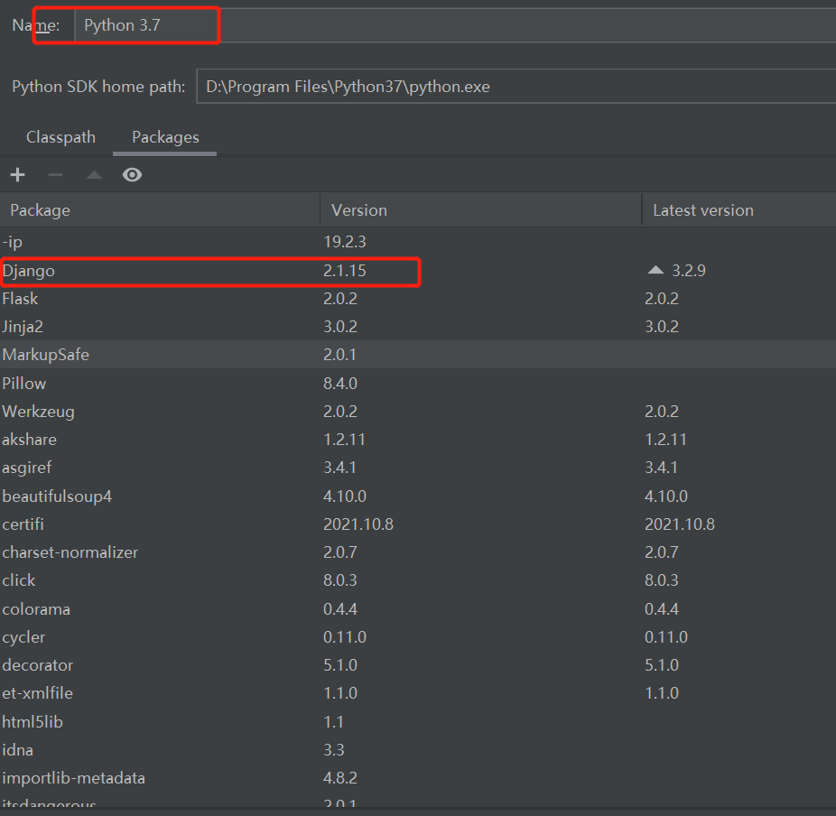

# akshare-api
原作者: [@luoda_123](仓库地址 
https://gitee.com/luoda_123/akshare-api)
介绍
整合python 金融Akshare服务,提供restful接口供其他语言调用

## 快速开始

启动服务

python manage.py runserver 8000

Akshare链接

https://akshare-4gize6tod19f2d2e-1252952517.tcloudbaseapp.com/index.html

Api调用方式

ip:port/api/{method} 如：localhost:8000/api/stock_zh_a_new
## 此项目
此项目用于备份akshare-api,且调试正常运行版本依赖.方便后续自己使用作为金融数据源的一个服务.

## 测试
~~~
DELL@DESKTOP-M42R5EL MINGW64 /d/jermaine/IdeaProjects/AKShare-Server
$ python AKShareServer.py runserver 8000
Performing system checks...

System check identified no issues (0 silenced).
November 09, 2021 - 14:20:58
Django version 2.1.15, using settings 'core.settings'
Starting development server at http://127.0.0.1:8000/
Quit the server with CTRL-BREAK.
Not Found: /
[09/Nov/2021 14:23:28] "GET / HTTP/1.1" 404 1918
[09/Nov/2021 14:37:07] "POST /api/stock_zh_a_new HTTP/1.1" 200 12581
~~~

## 开发环境及依赖
